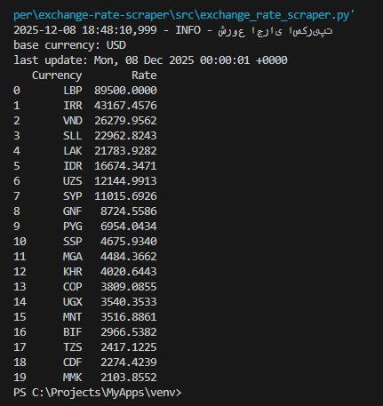
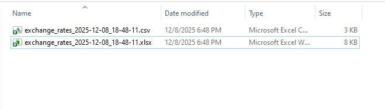

# Exchange Rate Scraper (Python)

This project fetches live currency exchange rates from `exchangerate-api`
and exports them into CSV and XLSX formats.

یک اسکریپت پایتون برای گرفتن نرخ ارز زنده از ExchangeRate-API و خروجی 
گرفتن به صورت CSV و Excel.

## Features
- Fetch live exchange rates
- Sort currencies by value
- Export to CSV and Excel
- Timestamp-based filenames
- Duplicate file check
- Simple GUI dialog (Tkinter)
- گرفتن نرخ ارز (برحسب USD)
- مرتب سازی نرخ ها و گرد کردن اعداد
- ذخیره با نام timestamped در پوشه "/exports"
- چک کردن وجود فایل و نمایش دیالوگ جایگزینی (tkinter)
- مدیریت خطا برای پاسخ API

## Requirements
Python 3.10+
کتابخانه ها: requests, pandas, openpyxl

## Installation
```bash
pip install -r requirements.txt

## Demo



